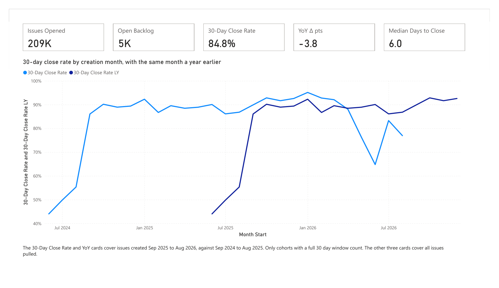
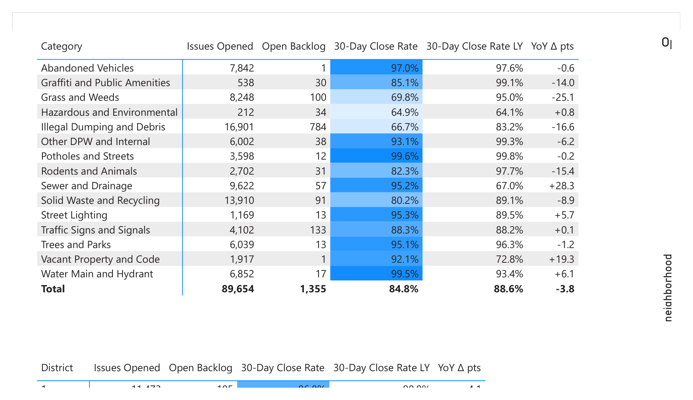
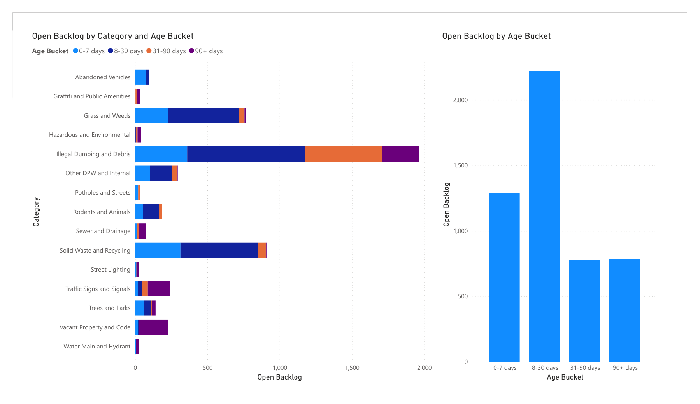

# Detroit 311 Service Performance


How fast does Detroit actually close the service requests residents file through Improve Detroit, and is it getting faster or slower by request type and council district?

The obvious answer, average days to close over closed issues, is biased. Slow issues that are still open drop out of the average, so the city looks faster than it is. I built a three page Power BI report around a 30 day close rate by creation month instead, compared with the same months a year earlier.

[Open the live report](https://app.powerbi.com/view?r=eyJrIjoiYjkzNWYyYjEtMTkyNS00Y2ViLWI4ZDctYzU4ZGRkOGRmZWJkIiwidCI6IjIyMTc3MTMwLTY0MmYtNDFkOS05MjExLTc0MjM3YWQ1Njg3ZCIsImMiOjN9) in Power BI. It opens on the second page, so use the arrows at the bottom to move between the three pages.

## What I found

Detroit closed 84.8% of requests within 30 days for issues created September 2025 through August 2026, against 88.6% for the 12 months before. That is 3.8 points slower.

- **The slowdown is concentrated.** Illegal Dumping and Debris went from 83.2% to 66.7%, Grass and Weeds from 95.0% to 69.8%, Graffiti and Public Amenities from 99.1% to 85.1%. Sewer and Drainage went the other way, from 67.0% to 95.2%, and Vacant Property and Code from 72.8% to 92.1%.
- **The recent months are the weak ones.** Cohorts from September 2025 through April 2026 close 88% to 95% of requests in 30 days. May through August 2026 run 76.4%, 64.8%, 83.3% and 76.9%.
- **The old backlog sits in three places.** 5,068 issues are still Open or Acknowledged. 784 of them are more than 90 days old, and Illegal Dumping and Debris (259), Vacant Property and Code (200) and Traffic Signs and Signals (154) make up 78.2% of those.
- **District 4 is slowest.** It closes 79.9% within 30 days, 7.0 points below a year earlier. District 3 is next at 81.0%. District 2 is the fastest numbered district at 87.4%.

[Read the memo](docs/memo.md) for who should act on these and what to do first: summer staffing for Grass and Weeds and Illegal Dumping, the 784 old requests, and District 4.

## What I expected and did not get

I expected a year over year comparison to be the main story. The first cohorts say otherwise. Issues created in July and August 2024 closed within 30 days only 49.8% and 55.3% of the time, then the rate jumped to 86.1% for September 2024 and stayed near 90% for a year. A step that sharp looks like a change in how the city closes or archives issues, not a change in service. I can not tell which from this data. It is why the headline comparison starts at September 2024 and why the August 2025 cohort shows a 31 point gain that I do not trust.

The heat map surfaced a data problem. 294 issues have their latitude and longitude swapped, so they plot in Antarctica until you filter them out. The heat map filters on latitude above 42 and drops them, along with the 19,495 issues that have no coordinates at all. That leaves 4,948 of the 5,068 open issues in the heat map.

## The report

Three pages in `Detroit311.pbix`, also exported to [docs/detroit311_report.pdf](docs/detroit311_report.pdf).

**Overview.** Five cards and the monthly trend. The 30 day rate and the year over year card cover issues created September 2025 through August 2026, the last 12 cohorts with a full 30 day window. The line chart shows every month against the same month a year earlier.



**Where and what.** 30 day close rate, last year's rate and the change, by request category and by council district, with the rate shaded. A heat map shows where the open issues are concentrated.



**Backlog aging.** Open issues bucketed by days since they were created (0 to 7, 8 to 30, 31 to 90, 90 plus), by request category.



## Data quality

**209,394 issues created June 30, 2024 through September 28, 2026 (pulled September 28, 2026). 2.4% are still open (Open or Acknowledged). 5.1% have no close date, because another 2.7% are Archived without ever being closed.**

| Status | Issues | Share |
|---|---:|---:|
| Closed | 197,605 | 94.4% |
| Archived | 6,721 | 3.2% |
| Acknowledged | 4,687 | 2.2% |
| Open | 381 | 0.2% |

## The data

Source: [Improve Detroit Issues](https://data.detroitmi.gov/datasets/detroitmi::improve-detroit-issues/about), the City of Detroit's open data feed of every non emergency request filed through the Improve Detroit app (potholes, illegal dumping, streetlights, water main leaks). I pull it straight from the city's [ArcGIS REST layer](https://services2.arcgis.com/qvkbeam7Wirps6zC/arcgis/rest/services/improve_detroit/FeatureServer/0), which holds about 753,000 issues back to 2014. I keep everything created on or after July 1, 2024.

Things that were easy to get wrong:

- **Paging.** The layer returns at most 1,000 records per request. `src/pull.py` orders by `ObjectId` and walks `resultOffset` until a page comes back short, with retry and exponential backoff. The full pull is 210 requests and takes about 5 minutes.
- **Errors inside a 200.** ArcGIS reports query errors in the JSON body with HTTP 200, so the script checks for an `error` key instead of trusting the status code.
- **Time zones.** Dates come back as epoch milliseconds in UTC. I convert them to Detroit local time. The server applies the date filter in UTC, which is why 25 issues from the evening of June 30 local time are included.
- **"Open" is not the same as "no close date".** Archived issues have no `closed_at` but are not open either. Treating every missing `closed_at` as open would roughly double the backlog.
- **Reopened issues.** 616 issues have a `reopened_at`. I keep that column. A few reopened issues are back in Open or Acknowledged status while still carrying their old `closed_at`.

Cleaning drops exact duplicate `issue_id`s and rows with no `created_at`, and logs the row count after each step. On this pull neither step removed anything.

The parquet file is not committed. Run the script to rebuild it.

## How it works

`Detroit311.pbix` is a star schema. `Issues` is the fact table, with `Calendar` (marked as the date table), `Request Type` and `District` around it. I mapped the 69 raw request types into 15 categories in `docs/request_type_map.csv`. The DAX is in [docs/measures.md](docs/measures.md).

The headline measure is the 30 day close rate by creation month. It only counts issues created at least 30 days before the newest one in the data, so every issue had a full window to close. I also show the median days to close, which only sees closed issues and so runs optimistic.

The backlog aging page uses three calculated columns on `Issues`. Age is the days between an issue's creation and the newest issue in the data, not today's date, so the buckets do not drift when the file is opened later.

I checked the measures against pandas for August 2025 (`python src/check_measures.py 2025-08`). All six match: 9,527 issues opened, 22 still open, median 9 days, 30 day close rate 86.8% against 55.3% a year earlier. The findings above come from `python src/findings.py`, and they match the numbers on the report pages. The memo figures come from `python src/memo_numbers.py`.

## How to run it

```
pip install -r requirements.txt
python src/pull.py
python -m pytest
python src/findings.py
```

Open `Detroit311.pbix` and point the `RepoFolder` parameter at your clone (Transform data, Edit parameters).

`pull.py` writes `data/issues.parquet` and logs the summary line above.

## What would break this

- The data records when an issue was marked closed, not whether the problem was fixed.
- The September 2024 step described above is unexplained. Cohorts before it are not comparable with cohorts after it.
- I have not checked whether the May and June 2026 dip is a real slowdown or a change in how the city records closures.
- Backlog uses the status field. An issue marked Acknowledged may have been worked on and never updated.
- 5.9% of issues have no council district, so district level rates are computed on a slightly smaller set. They show as Unknown in the district table.
- Request types are free text with 69 distinct values in this window, some of them near duplicates. I grouped them by judgment from the names, and a few internal DPW codes land in an Other bucket (8.6% of issues).
- The layer is live. A later pull will not match these counts exactly.

## What I would do next

Find out what changed in the city's closing process around September 2024, and test whether the 2026 dip survives a longer window. A 60 day close rate would show whether slow issues are still closing or have stalled. Council district boundaries would let me put the backlog on a real map without a Bing dependency.
